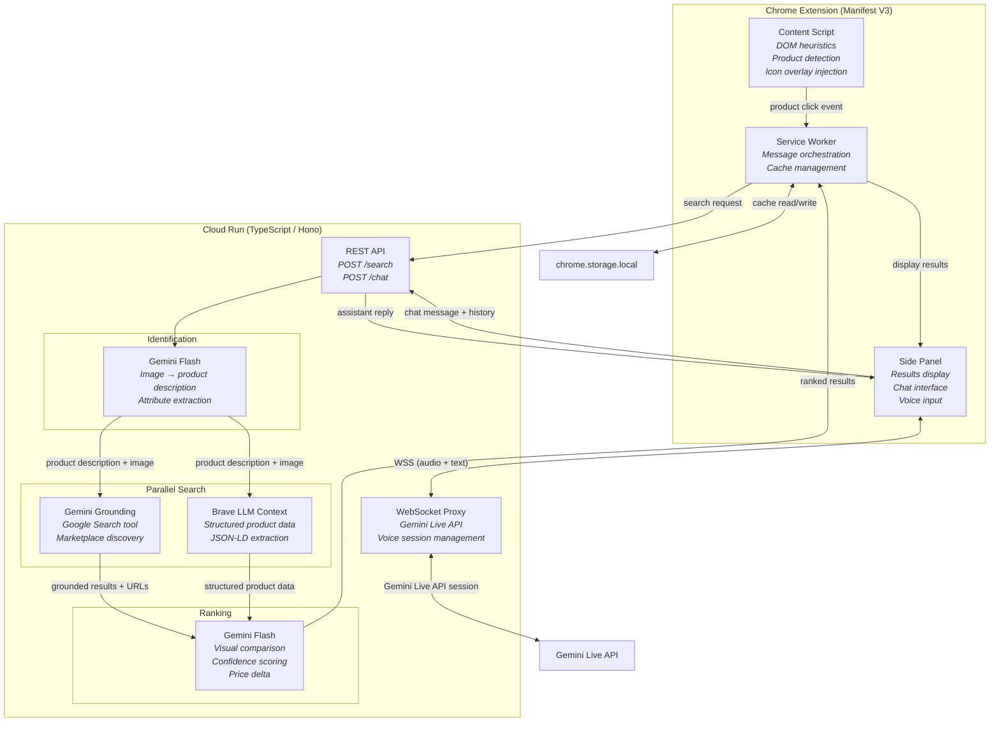

# Shopping Source Discovery Agent — Architecture Specification

## Project Overview

A Chrome extension (Manifest V3) that detects products on any shopping page, finds cheaper alternatives across consumer marketplaces, and provides a conversational AI assistant for product comparison — all powered by Gemini and Brave Search.

**Target category:** Gemini Live Agent Hackathon — Live Agents (real-time audio/vision interaction)

---

## Design Principles

- **On-demand, not ambient.** The extension detects products passively but only searches when the user acts. This conserves API calls, avoids rate limits, and ensures every search is intentional.
- **Gemini-native.** Gemini handles identification, grounding search, ranking, and conversation. Brave Search provides the structured product data layer that Gemini Grounding alone cannot reliably deliver.
- **Stateless backend.** Cloud Run handles orchestration and Live API proxying. No database, no user accounts, no persistence. Session state lives in the extension's local storage.
- **Progressive feedback.** Detection is instant (DOM heuristics). The side panel opens immediately and shows phase-based loading updates while search runs. The user is never staring at a blank loading screen.

---

## System Components

### 1. Chrome Extension (Manifest V3)

The extension is the entire client. It handles product detection, user interaction, and results display.

**Content Script** — Injected into web pages. Runs DOM heuristics to detect product elements. Injects small overlay icons on detected product images. Listens for user clicks on overlay icons and sends messages to the service worker.

**Service Worker** — Extension background process. Orchestrates communication between content script, side panel, and Cloud Run backend. Manages `chrome.storage.local` for caching search results. Handles extension lifecycle events.

**Side Panel (Side Panel API)** — The primary results and chat interface. Displays search results with product cards (image, title, price, marketplace, confidence score, savings percentage). Contains the hybrid chat interface (text input + microphone button). Manages WebSocket connection to Cloud Run for Gemini Live API voice interaction.

**Why Side Panel over Popup:** Side panels persist while the user navigates the page. Popups close on any outside click, which makes them unusable for a comparison shopping workflow where the user needs to look at the product page and results simultaneously.

### 2. Cloud Run Backend (TypeScript / Hono)

A single stateless service with three responsibilities:

**Search Orchestration** — Accepts a product search request (image + metadata). Calls Gemini Flash for product identification, then fans out parallel searches to Gemini Grounding and Brave LLM Context API. Merges and deduplicates results. Calls Gemini Flash again for visual ranking. Returns ranked results.

**Text Chat Orchestration** — Accepts contextual chat prompts (`POST /chat`) containing the current product, ranked results, and recent message history. Calls Gemini Flash and returns a text response for the side panel thread.

**Live API Proxy** — Maintains WebSocket connections between the extension's side panel and Gemini Live API. MV3 service workers cannot hold long-lived connections, and provider credentials must stay server-side. Cloud Run acts as the persistent endpoint: the side panel connects to Cloud Run via `wss://`, and Cloud Run maintains the upstream Gemini Live API session.

**Why Hono:** Lightweight, fast, built-in WebSocket support, and runs natively on Node.js for Cloud Run. Lower overhead than Express for a small API surface (2 REST endpoints + 1 WebSocket).

**Why Cloud Run:** Serverless, scales to zero when not in use (cost-efficient for hackathon), supports WebSocket connections, and runs on GCP where Gemini API latency is lowest. No infrastructure to manage.

### 3. External APIs

**Gemini 2.0 Flash (multimodal)** — Used for three distinct tasks:
1. Product identification: image → structured product description
2. Grounded search: text query with Google Search tool enabled → marketplace results with source URLs
3. Visual ranking: original image + result images → confidence scores and comparison reasoning

**Gemini Live API** — Powers the conversational voice assistant. The session receives product context (current page product + search results) and can answer follow-up questions, explain comparisons, and help the user make purchasing decisions.

**Brave Search API (LLM Context endpoint)** — Independent web index search that returns structured data extracted from product pages, including JSON-LD schema data (title, price, image URL, product URL, availability). This is the structured data backbone that makes reliable product cards possible.

---

## Architecture Diagram



---

## Key Architectural Decisions

### Why DOM heuristics over screenshot analysis for detection

Screenshot analysis with Gemini Vision would work on any page layout, but adds 1-3 seconds of latency and a Gemini API call on every page load — even pages with no products. DOM heuristics (schema.org markup, Open Graph tags, price pattern detection) run in under 100ms with zero API cost. For the hackathon, we optimize for the common case: major shopping sites that use structured markup. Gemini screenshot fallback can be added later for sites without structured DOM.

### Why on-click search over background prefetching

A product listing page might have 30+ items. Prefetching searches for all of them would exhaust API quotas, waste tokens on products the user never engages with, and risk rate limiting from both Gemini and Brave. On-click search means every API call corresponds to genuine user intent. Results are cached, so a second click on the same product is instant. The 4-10 second search latency is acceptable because the user explicitly requested it — they know they're waiting for a search, not for a page to load.

### Why Gemini Grounding + Brave (dual search) over either alone

Gemini Grounding (Google Search) has the broadest index but returns unstructured data — prose summaries and source URLs, not clean product fields. Brave LLM Context API has a smaller but independent index and returns structured data extracted from JSON-LD schemas on product pages (title, price, image, URL). Running both in parallel costs ~200ms of additional latency (they're concurrent) but dramatically improves both coverage and data quality. Results are merged and deduplicated before ranking.

### Why Cloud Run WebSocket proxy for voice

MV3 service workers cannot maintain persistent connections, and provider credentials must remain server-side. The Gemini Live API requires a persistent WebSocket session for streaming audio. Cloud Run bridges this gap: the side panel (which does persist as long as it's open) connects to Cloud Run via WSS, and Cloud Run maintains the upstream Live API session. This keeps the extension MV3-compliant while enabling real-time voice interaction without exposing API keys.

### Why no database or user accounts

For a hackathon MVP, persistence adds complexity without adding demo value. Search results are cached locally in the browser session. When the user closes the extension or clears their session, everything resets. This also sidesteps privacy concerns — no user data is stored server-side, ever.

### Why explicit backend guardrails for MVP

Even in a stateless hackathon architecture, the backend still needs abuse controls and deterministic fallback behavior:

- **Credential isolation:** Gemini and Brave API keys live only in Cloud Run env vars/secrets, never in extension code.
- **Basic abuse controls:** enforce extension-origin CORS allowlist plus per-IP rate limits at Cloud Run or edge.
- **Graceful degradation:** `/search` returns partial results when one source times out, with source-level status metadata.
- **Transport security:** all extension↔backend traffic uses HTTPS/WSS only.

---

## Monorepo Structure

TypeScript monorepo with shared types across extension and backend. Single language eliminates type duplication and reduces context-switching during hackathon development.

```
shopping-assistant/
├── packages/
│   ├── shared/              # Shared TypeScript types + constants
│   │   └── src/
│   │       ├── types.ts     # DetectedProduct, SearchRequest, SearchResponse, etc.
│   │       └── constants.ts # Marketplace configs, thresholds, prompt templates
│   │
│   ├── extension/           # Chrome Extension (Vite + React)
│   │   ├── src/
│   │   │   ├── content/     # Content script — DOM heuristics, overlay injection
│   │   │   ├── background/  # Service worker — message routing, cache management
│   │   │   ├── sidepanel/   # React app — results UI, chat interface
│   │   │   └── manifest.json
│   │   └── vite.config.ts
│   │
│   └── backend/             # Cloud Run API (Hono + Node.js)
│       ├── src/
│       │   ├── routes/      # /search, /chat endpoint handlers
│       │   ├── services/    # Gemini client, Brave client, ranking logic
│       │   ├── ws/          # WebSocket handler for Live API proxy
│       │   └── index.ts     # Hono app entry point
│       └── Dockerfile
│
├── package.json             # pnpm workspace root
├── pnpm-workspace.yaml
└── tsconfig.base.json       # Shared compiler config
```

**Package manager:** pnpm workspaces for fast installs and strict dependency isolation.

**Build tooling:**
- Extension: Vite with CRXJS plugin (handles MV3 builds, hot reload during development)
- Backend: tsup or esbuild for fast bundling into a single Cloud Run deployable
- Shared: compiled to JS and consumed as a workspace dependency by both packages

---

## Infrastructure & Deployment

| Component | Runtime | Scaling |
|-----------|---------|---------|
| Chrome Extension | User's browser (Vite + React) | N/A |
| Cloud Run Service | GCP (Node.js / Hono) | 0 → N instances, auto-scaled |
| Gemini API | GCP | Managed by Google |
| Brave Search API | Brave infrastructure | Managed by Brave |

**Cost estimate (hackathon scale):**
- Gemini Flash: ~$0.0001-0.0003 per image analysis call — negligible
- Gemini Grounding: billed per search query generated — covered by GCP credits
- Brave LLM Context: $5/1k requests, ~1k free monthly credits — sufficient for hackathon
- Cloud Run: billed per request + CPU time — negligible at demo scale

---

## Scope Boundaries

**In scope for hackathon MVP:**
- Product detection on major shopping sites via DOM heuristics
- Single-product search triggered by user click
- Parallel search across Gemini Grounding + Brave
- Visual ranking with confidence scores
- Side panel with product result cards
- Hybrid text/voice chat via Gemini Live API
- Local session caching

**Explicitly out of scope:**
- User accounts, login, or server-side persistence
- Affiliate link integration or revenue model
- Screenshot-based product detection (Gemini Vision fallback)
- Background prefetching or batch search queue
- Chrome Web Store distribution (sideloaded for demo)
- Multi-language support
- Mobile or non-Chrome browsers
